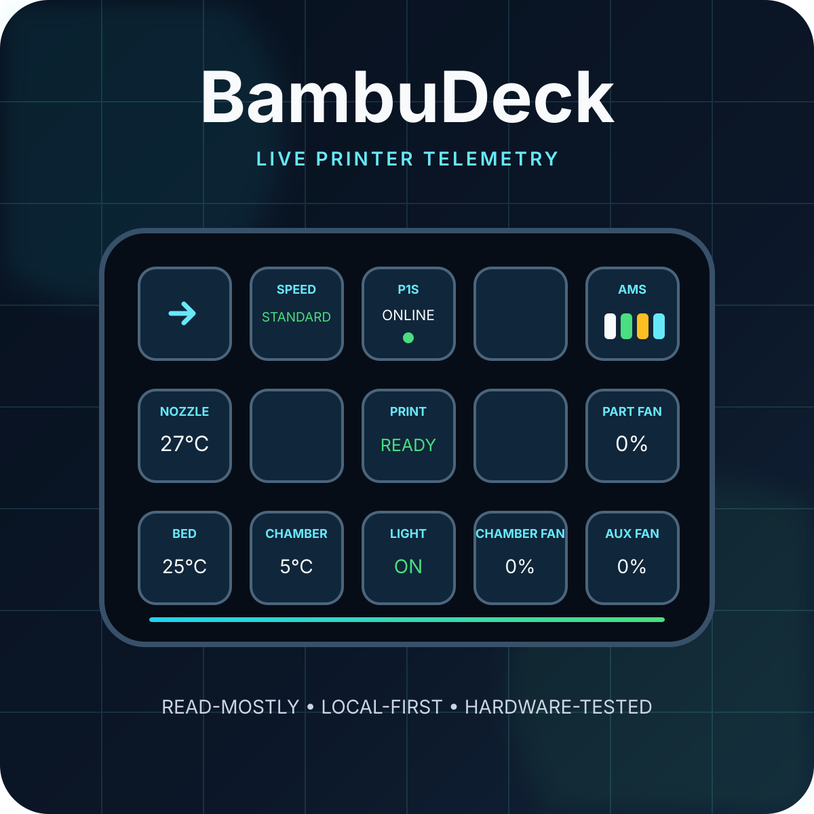
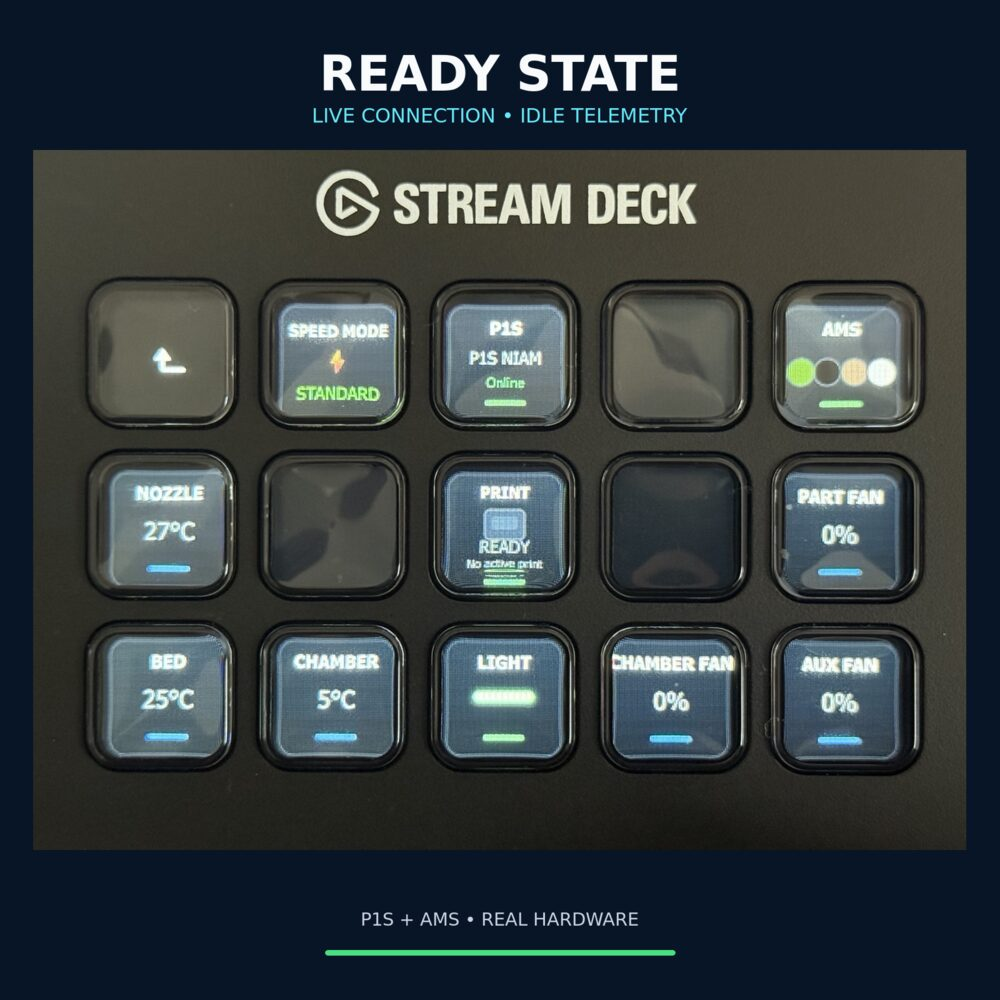
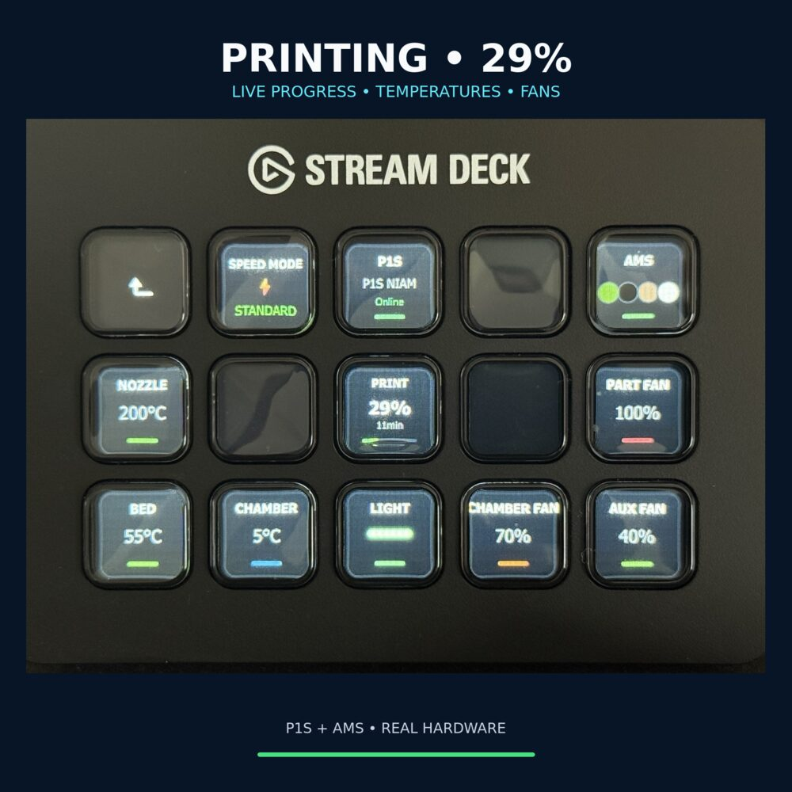
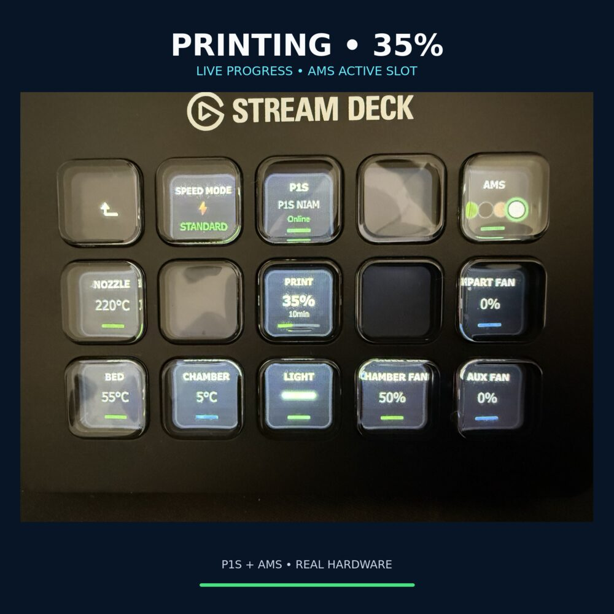
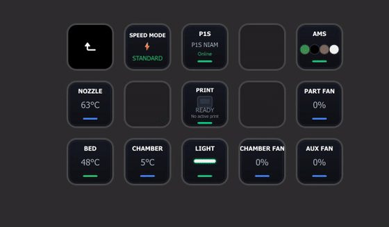
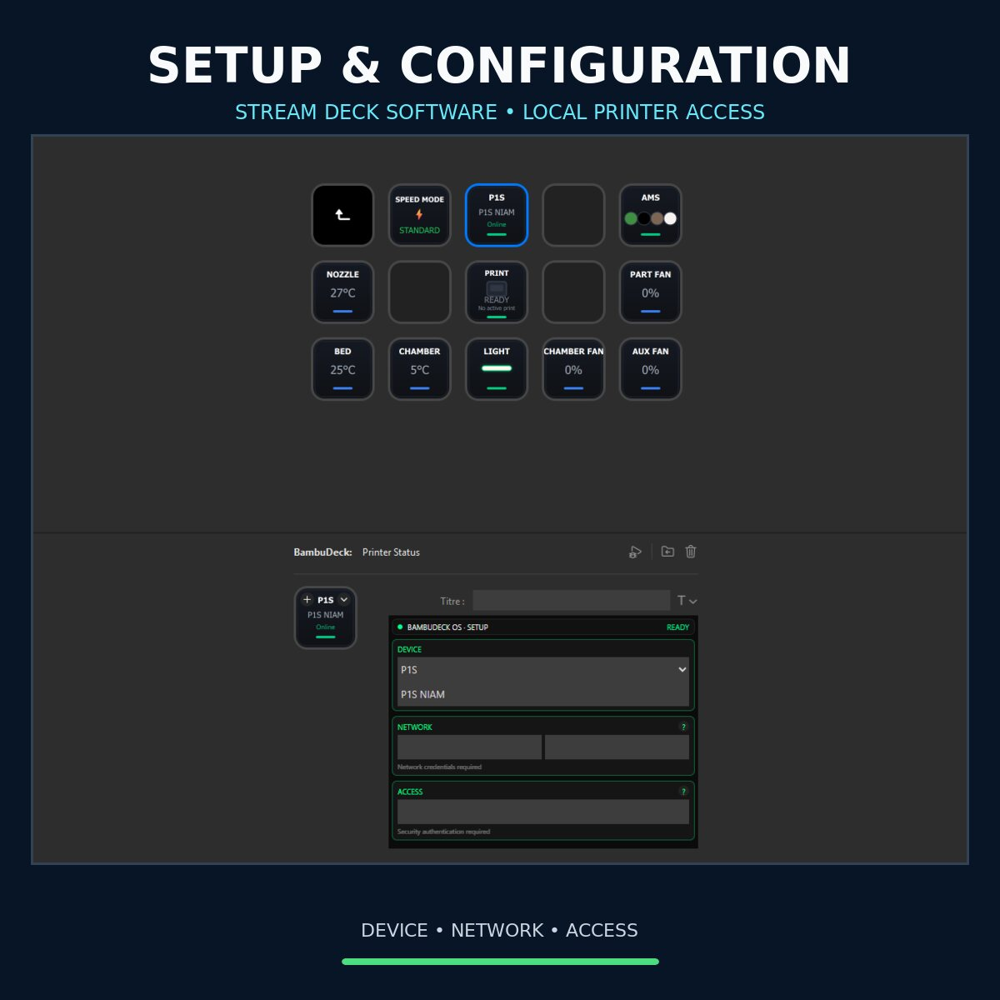
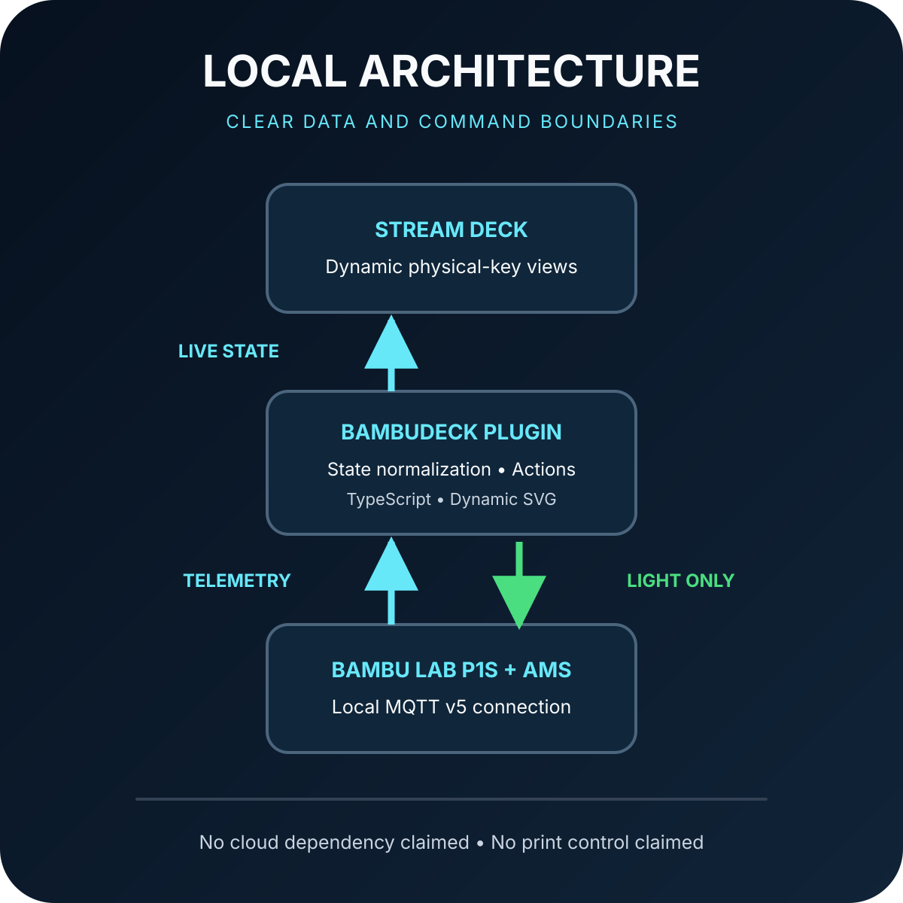

  

  <strong>Live Bambu Lab printer telemetry, presented on a physical Stream Deck interface.</strong>

  
  
  

## What is BambuDeck?

BambuDeck is an independent Stream Deck integration built to make essential 3D-printer information visible at a glance, without keeping a slicer or mobile application in the foreground.

The current working prototype connects locally to a **Bambu Lab P1S with AMS**, receives live printer telemetry and turns that information into compact, dynamic key displays.

> **Current safety scope:** BambuDeck reads printer data. The **only printer command currently implemented is chamber-light ON/OFF**.

## Working proof

The prototype has been tested on real hardware, not only with simulated data. These three photographs show the same physical interface reacting to different live printer states.

| Ready | Printing · 29% | Printing · 35% |
| :---: | :---: | :---: |
|  |  |  |

Across the sequence, progress, temperatures, fan values and the active AMS slot change with the printer. The light key demonstrates the single implemented write command.

### Animated demonstration

This optimized 36-second timelapse shows the interface evolving during a real P1S + AMS print: printer state, progress, temperatures, fan values, speed mode, AMS colors and the active tray indicator update over time.

## Setup and configuration

| Stream Deck software integration | Configuration flow |
| --- | --- |
|  | BambuDeck includes a dedicated Property Inspector inside the Stream Deck software. The current setup is organized into **Device**, **Network** and **Access** sections, with a visible readiness state. Connection secrets are deliberately absent from public media. |

The interface allows the user to select the target printer and enter the local connection information required by that device. Once the configuration is usable, the action reports a clear **READY** state instead of leaving the connection status ambiguous.

## Current feature set

| Area | Information displayed | Direction |
| --- | --- | --- |
| Connection | Missing, connecting, ready and disconnected states | Printer → Deck |
| Printer state | Idle, printing, paused, error or unknown | Printer → Deck |
| Print job | Progress and estimated remaining time | Printer → Deck |
| Temperatures | Nozzle, bed and chamber values | Printer → Deck |
| Cooling | Part, auxiliary and chamber fan values | Printer → Deck |
| Speed | Current printer speed mode | Printer → Deck |
| AMS | Slot colors, empty slots and active-tray highlight | Printer → Deck |
| Chamber light | Current state plus ON/OFF action | Deck ↔ Printer |

No start, pause, resume, stop, temperature, fan or motion command is part of the demonstrated control scope.

## Dynamic visual language

BambuDeck does not only replace numbers on static keys. The interface changes visually with the live printer state:

- temperature and fan keys include a value-dependent color bar;
- low or inactive values remain cool blue;
- normal active values move to green;
- higher fan levels progress through warmer accents, up to red at maximum output;
- print progress updates both the percentage and its progress indicator;
- the speed-mode key changes its label, symbol and accent for the reported mode;
- the AMS view reproduces the reported slot colors;
- the active AMS tray receives a visible ring.

The photographs above show these changes on real hardware: for example, the fan bars move from blue at 0% to green, orange and red as their reported output increases. Exact visual thresholds remain implementation details until the release behaviour is finalized.

## How it works

  

1. The plugin connects to the printer over the local network.
2. MQTT reports are normalized into one predictable internal printer state.
3. Each Stream Deck action subscribes only to the state it needs.
4. Dynamic SVG views turn live values into readable physical-key interfaces.
5. The chamber-light action sends the only currently supported command.

The working implementation is written in **TypeScript**, uses the **Elgato Stream Deck SDK v2** and communicates through **MQTT v5**.

## Design principles

- **Glanceable:** the important value must remain readable on a small physical key.
- **Local-first:** printer communication stays on the local network.
- **State-driven:** every key reflects the printer state instead of displaying a static shortcut.
- **Safe by default:** monitoring comes first; printer commands are added only when their behaviour and failure states are understood.
- **Hardware-tested:** claims are based on the real P1S + AMS prototype shown above.

## Possibilities

These are development possibilities, not claims about the current public build:

- additional Bambu Lab models after model-specific testing;
- configurable layouts for different Stream Deck sizes;
- multiple-printer profiles;
- richer job pages with file name, layer progress and remaining-time detail;
- a dedicated AMS detail page for each tray;
- detailed filament color and material information when reported by the printer;
- AMS humidity level and internal temperature monitoring;
- multi-AMS overview and navigation;
- clearer empty, unavailable and third-party spool states;
- optional safety-confirmed print controls;
- reusable printer adapters for future hardware integrations.

## Project maturity

| Completed | In progress | Future validation |
| --- | --- | --- |
| Local P1S connection | Presentation and documentation | Additional printer models |
| Live telemetry state | Distribution preparation | Multi-printer support |
| Dynamic Stream Deck UI | Marketplace review material | Additional commands |
| AMS visualization | Compatibility documentation | Public release scope |
| Chamber-light toggle | Demo media | Long-term maintenance |

## Documentation

- [Detailed feature behaviour](./docs/FEATURES.md)
- [Technical architecture](./docs/ARCHITECTURE.md)
- [Setup and configuration](./docs/CONFIGURATION.md)
- [Safety and data boundaries](./docs/SAFETY.md)
- [Development roadmap](./docs/ROADMAP.md)

## Status and availability

BambuDeck is currently presented as a **working private prototype and public technical showcase**. This repository documents the product and its demonstrated behaviour; it does not currently publish the proprietary plugin source code or promise Marketplace availability.

## Independence

BambuDeck is an independent project. It is not affiliated with, endorsed by or sponsored by Bambu Lab or Elgato. Product and company names belong to their respective owners.
