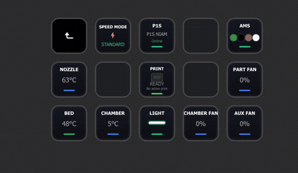

  

  <strong>Live Bambu Lab printer and AMS telemetry directly on Stream Deck.</strong>

  
  &nbsp;&nbsp;
  

  
  
  

## What is BambuDeck?

BambuDeck is an independent Stream Deck integration for Bambu Lab printers. It turns live printer, print-job and AMS information into compact physical-key displays so the most useful information remains visible without keeping Bambu Studio or a mobile app in the foreground.

**BambuDeck is officially available on the Elgato Marketplace.**

Version **1.2.0.0** introduces dedicated **Home**, **Print** and **AMS** profiles, built-in navigation, a much larger telemetry library and one of BambuDeck's signature features: **Print Preview**.

> **Safety scope:** BambuDeck is monitoring-first. The only printer command currently implemented is chamber-light ON/OFF. Print controls, temperature controls, fan controls and motion commands are not part of this release.

## Print Preview — the model on the key

  

The **Print Preview** action can retrieve the active print archive from the printer over the local network using read-only FTPS access, extract the plate thumbnail from the current `.gcode.3mf`, cache it and display the model directly on a Stream Deck key.

Instead of seeing only a file name or percentage, the current model is visible beside the live printer telemetry. If no usable preview is available, the key falls back to a clear `NO PRINT` state rather than leaving stale artwork on screen.

## Highlights in v1.2

- Ready-to-use **Home**, **Print** and **AMS** Stream Deck profiles.
- Built-in navigation with a custom BambuDeck back button.
- **Print Preview** showing the current plate/model directly on a Stream Deck key.
- Print job name, layer progress and speed factor.
- Wi-Fi signal and printer error-code monitoring.
- Nozzle and bed **target temperatures** in addition to live temperatures.
- Hotend fan monitoring.
- Expanded AMS telemetry: humidity, temperature, material, remaining filament, profile, calibration and drying information.
- AMS slot view with configurable AMS/slot selection.
- Existing live telemetry retained: printer status, progress, temperatures, fans, speed mode, AMS colors and active tray.

## Ready-to-use profiles

| Profile | Purpose |
| --- | --- |
| **Home** | Main printer overview and entry point |
| **Print** | Print Progress, Print Preview, Job Name, Print Layers, Print Speed Factor |
| **AMS** | AMS colors, slots and detailed AMS information |

Navigation is already configured in the distributed profiles. The custom BambuDeck back action returns from the Print or AMS profile to Home without relying on the default black Stream Deck navigation icon.

## Simple local setup — no Bambu Cloud login

BambuDeck is configured from its **Property Inspector** inside the Stream Deck software. The current setup is divided into **Device**, **Network** and **Access** sections.

  

BambuDeck does **not** require the user to sign in to a Bambu Cloud account. The plugin connects directly to the printer over the local network using the printer's local connection details and LAN access code.

The setup panel exposes clear configuration states such as **READY**, while public screenshots and documentation intentionally hide real local addresses, access codes and other authentication values.

The same local printer connection is shared by the detailed telemetry actions. Print Preview additionally uses the same local printer address/access information for its read-only FTPS retrieval.

## Current feature set

| Area | Action / information | Direction |
| --- | --- | --- |
| Connection | Missing, connecting, ready and disconnected states | Printer → Deck |
| Printer | Printer Status | Printer → Deck |
| Printer | Wi-Fi Signal | Printer → Deck |
| Printer | Printer Error Codes | Printer → Deck |
| Print | Print Progress + estimated remaining time | Printer → Deck |
| Print | Print Preview | Printer → Deck |
| Print | Job Name | Printer → Deck |
| Print | Print Layers | Printer → Deck |
| Print | Print Speed Factor | Printer → Deck |
| Temperature | Nozzle Temperature | Printer → Deck |
| Temperature | Nozzle Target | Printer → Deck |
| Temperature | Bed Temperature | Printer → Deck |
| Temperature | Bed Target | Printer → Deck |
| Temperature | Chamber Temperature | Printer → Deck |
| Cooling | Part Fan Speed | Printer → Deck |
| Cooling | Auxiliary Fan Speed | Printer → Deck |
| Cooling | Chamber Fan Speed | Printer → Deck |
| Cooling | Hotend Fan Speed | Printer → Deck |
| Speed | Current Speed Mode | Printer → Deck |
| AMS | AMS Colors + active tray highlight | Printer → Deck |
| AMS | AMS Slot | Printer → Deck |
| AMS | AMS Humidity | Printer → Deck |
| AMS | AMS Temperature | Printer → Deck |
| AMS | AMS Filament Remaining | Printer → Deck |
| AMS | AMS Filament Material | Printer → Deck |
| AMS | AMS Filament Profile | Printer → Deck |
| AMS | AMS Calibration Info | Printer → Deck |
| AMS | AMS Drying Info | Printer → Deck |
| Control | Chamber Light | Deck ↔ Printer |

## Working proof

BambuDeck is tested on real hardware, not only with simulated telemetry.

| Ready | Printing · 29% | Printing · 35% |
| :---: | :---: | :---: |
|  |  |  |

### Animated demonstration

The demonstration shows live printer state, progress, temperatures, fan values, speed mode, AMS colors and active-tray changes during a real P1S + AMS print.

## Dynamic visual language

BambuDeck uses dynamic SVG rendering rather than static text-only keys:

- print progress updates both percentage and progress indicator;
- temperature and fan keys use value-dependent accent bars;
- speed mode changes its label, symbol and accent;
- AMS colors reproduce reported spool colors;
- the active AMS tray receives a visible highlight;
- connection and missing-data states are visually distinct;
- Print Preview renders the active plate image when available.

## How it works

  

1. The plugin connects to the printer over the local network.
2. MQTT reports are normalized into one internal printer state.
3. Each Stream Deck action subscribes only to the state it needs.
4. Dynamic SVG views turn live values into readable physical-key interfaces.
5. **Print Preview** can additionally use local read-only **FTPS** to retrieve the current `.gcode.3mf` and extract its plate image.
6. The chamber-light action sends the only currently supported printer command.

The implementation is written in **TypeScript**, **MQTT v5**, and local **FTPS** for print-thumbnail retrieval.

## Compatibility

The current hardware validation is performed on a **Bambu Lab P1S + AMS**.

BambuDeck is designed around telemetry exposed by Bambu Lab printers and is intended to support models such as **A1, P1P, P1S and X1C**, but model-specific values and AMS capabilities can vary. Additional models should be considered compatible only after real-device validation.

## Design principles

- **Glanceable:** useful information must remain readable on a small physical key.
- **Local-first:** printer communication stays on the local network.
- **State-driven:** each key reflects current printer data rather than a static shortcut.
- **Monitoring-first:** write commands are deliberately limited.
- **Hardware-tested:** published behaviour is validated on real equipment.

## Project status

BambuDeck **v1.2.0.0** is officially available on the **Elgato Marketplace**.

The current release includes dedicated **Home**, **Print** and **AMS** profiles, expanded live telemetry, local MQTT communication, FTPS-based Print Preview and real-hardware validation on a Bambu Lab P1S + AMS.

  <a href="https://marketplace.elgato.com/product/bambudeck-1279275e-0239-488d-b7b3-cca63f8a4c7f">
    <strong>Get BambuDeck on the Elgato Marketplace</strong>
  </a>

This repository serves as the public technical showcase and documentation for BambuDeck. It does not publish the proprietary plugin source code.

## Documentation

- [Detailed feature behaviour](./docs/FEATURES.md)
- [Technical architecture](./docs/ARCHITECTURE.md)
- [Setup and configuration](./docs/CONFIGURATION.md)
- [Safety and data boundaries](./docs/SAFETY.md)
- [Development roadmap](./docs/ROADMAP.md)

## Independence

BambuDeck is an independent project. It is not affiliated with, endorsed by or sponsored by Bambu Lab or Elgato. Product and company names belong to their respective owners.
